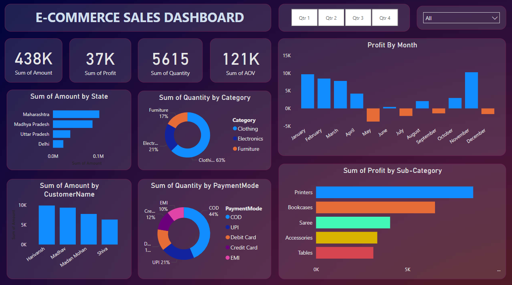

# 📊 E-Commerce Sales Dashboard - Power BI Project

## 🌟 Objective

To master the art of **data_visualization_and_storytelling** using Power BI by transforming raw e-commerce sales data into insightful visual reports that highlight business performance, customer behavior, and sales trends.

---

## 🛠️ Tools & Technologies

- **Power BI** for data modeling and interactive dashboard creation  
- **Superstore.csv** (or any similar e-commerce dataset)  
- **DAX** for calculated fields and KPIs  
- **Power Query** for data transformation  

---

## 📸 Dashboard Overview

| Metric                     | Value     | Insight |
|---------------------------|-----------|---------|
| 💰 **Total Sales Amount** | 438K      | Indicates strong overall revenue |
| 💹 **Total Profit**        | 37K       | Reveals moderate profitability |
| 📦 **Total Quantity Sold**| 5615      | Shows product movement volume |
| 🧮 **Average Order Value**| 121K      | High AOV suggests premium products or bulk buying |

---

## 📊 Visualizations & Storytelling

### 🗺️ **Sum of Amount by State**
- **Top States**: Maharashtra & Madhya Pradesh  
- Helps identify high-performing regions for targeted campaigns  

### 🧑‍💼 **Sum of Amount by Customer Name**
- Key Customers: Harivansh, Madhav, Madan Mohan  
- Helps personalize offers and loyalty rewards  

### 📦 **Sum of Quantity by Category (Donut Chart)**
- **Clothing** leads with 63% of total quantity  
- Suggests popular demand; useful for stock planning  

### 💳 **Sum of Quantity by Payment Mode**
- **COD (44%)** is most used, followed by **UPI** and **Debit Card**  
- Indicates strong need for reliable COD logistics  

### 📆 **Profit by Month (Bar Chart)**
- Peaks in **January & December**, dips in **May**  
- Useful for seasonal marketing and discount analysis  

### 📚 **Profit by Sub-Category**
- Highest: **Printers**, Lowest: **Tables**  
- Suggests where to focus sales efforts and where to optimize pricing  

---

## 🎯 Business Insights

- **Clothing & Electronics** categories are driving most sales — expand these segments.
- States like **Maharashtra** should be further nurtured through regional offers.
- Address **negative profit** months (e.g., May) to reduce overall loss.
- Promote **UPI & card payments** to reduce dependency on COD.
- Strengthen customer retention strategies for **top buyers**.
  
---

## 🎨 Design Principles

- Clean layout with distinct KPI cards and visual separation  
- Color-coded charts (blue = positive, orange/red = caution areas)  
- Interactive filters (Quarters, Categories) for user flexibility  
- Minimalist design to **avoid visual clutter**

---

## 🧾 Deliverables

- ✅ Power BI Interactive Dashboard  
- ✅ Dashboard Screenshot (`Dashboard_pic.png`)  
- ✅ Documentation (`README.md`)

---

## 📚 Key Learnings

- Developed skills in **Power BI**, **DAX**, **Data Cleaning**, and **Visual Storytelling**  
- Understood the importance of converting **raw data into business insights**  
- Learned how to design **clear, interactive dashboards** for real-world use  

---

## 🔗 Connect with Me

- [LinkedIn Profile](https://www.linkedin.com/in/aeshaprajapati12/)

