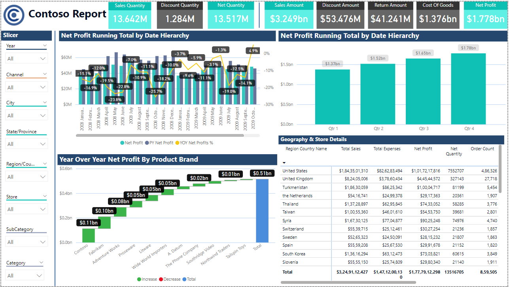

# 🛍️ E-Commerce Power BI Dashboard – Interview Project



This project features a professional e-commerce sales dashboard built in Power BI and includes an interview-focused presentation. It demonstrates key metrics, interactive visualizations, and advanced reporting techniques, making it ideal for job interviews and analytics portfolios.

---

## 📁 Project Structure

```plaintext
Dashboard_Design/
├── pic.png                               # Snapshot of the Power BI Dashboard
├── PowerBI_Dashboard_PPT.pptx # PowerPoint presentation with dashboard + interview Q&A
├── README.md                             # Project documentation file

----

📊 Dashboard Features
Main KPIs Displayed:

🟢 Net Profit
📦 Sales Quantit
💵 Sales Amount
🔁 Return Amount

---

Visual Highlights:
Net Profit Trend (Line Chart)
YoY Net Profit by Brand (Bar Chart)
Return vs Quantity (Combo Chart)
Profit by State (Map)
Interactive Filters (Slicers):

📆 Year
🌍 Region & City
🛍️ Store & Category
📺 Channel

---

📌 Power BI Interview Topics Covered
The included presentation answers common Power BI interview questions:

Key Elements of a Dashboard
What is a KPI?
What are Slicers in Power BI?
Power BI vs Tableau
How to Make a Dashboard Interactive
Handling Large Datasets in Dashboard
Chart Types for Trend Analysis

---

⚙️ Tools & Dataset
Tool Used: Power BI Desktop
Dataset: E-commerce dataset (custom CSV, not shared publicly)
Data Fields: Order Date, Region, Product Category, Sales, Returns, Profit, Channel, Store, etc.

🎯 Key Insights from Dashboard
High Net Profit in Q4 with Clothing as top-selling category.
Most Sales from COD as Payment Mode.
Strongest Region: Maharashtra
YoY Trends show growth in Electronics and Furniture in later quarters.
Harivansh & Madhav identified as top customers.

---

💡 Features & Best Practices
📌 Use of DAX Measures for KPI calculations.
🧠 Interactive slicers and drilldowns for deep data exploration.
🎨 Elegant visual theme with dark background and vibrant charts.
🔎 Bookmarks and filters for quarter-wise analysis.
✨ Tooltips and labels added for accessibility and clarity.

---

📽️ Presentation Overview
File: PowerBI_Dashboard_PPT.pptx

Includes:
Dashboard snapshot & breakdown
Interview answers (Power BI concepts)
Charts explanation & use-cases
Differences between BI tools (Power BI vs Tableau)
Conclusion slide summarizing the project value

